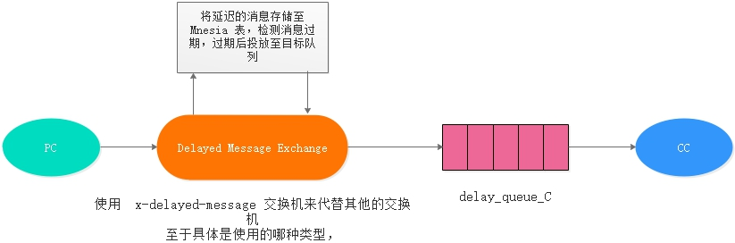

# rabbitmq知识:


## 1: 基础架构 概念 
## 2： 工作模式 交换类型
## 3： 发送者· 消费者 监听 消息
消息监听，在 @RabbitListener 注解的方法中，使用 @Payload 和 @Headers 注解可以获取消息中的 body 和 headers 消息。它们都会被 MessageConvert 转换器解析转换后(使用 fromMessage 方法进行转换)，将结果绑定在对应注解的方法中。

```
    @RabbitListener(containerFactory = "myListenerFactory", bindings = {
@QueueBinding(
        value = @Queue(value = "${rabbitmq.queue.routing.beijing}", durable = "true", autoDelete = "false"),
        exchange = @Exchange(
                value = "${rabbitmq.exchange.routing}",
                durable = "true",
                type = ExchangeTypes.TOPIC),
        key = "china.#")}, id = "autoStart")
public void receive(@Payload Message message, Channel channel,
            @Headers Map<String, Object> headers,
            @Header(AmqpHeaders.RECEIVED_ROUTING_KEY) String routingKey, @Header(AmqpHeaders.MESSAGE_ID) String messageId, @Header(AmqpHeaders.DELIVERY_TAG) long deliveryTag) throws IOException {
System.out.println("路由监听接受到发送者发送的信息：" + new String(message.getBody()));
//        int i = 1 / 0;
// 确认消息
channel.basicAck(deliveryTag, false);
}
```


```
@RabbitListener 和 @RabbitHandler 搭配使用
@RabbitListener 可以标注在类上面，需配合 @RabbitHandler 注解一起使用。
@RabbitListener 标注在类上面表示当有收到消息的时候，就交给 @RabbitHandler 注解的方法进行分发处理，具体使用哪个方法处理，根据 MessageConverter 转换后的参数类型
```


## 4： 消息convert转换 
MessagePropertiesConverter 和 MessageConverter
有一个DefaultMessagePropertiesConverter， ，MessageConverter 其实现有 SimpleMessageConverter（默认）、Jackson2JsonMessageConverter 等。
如果自定义了消息转换器需要在factory注册上


## 5： 消息确认 不丢失
## 6： 消息延迟
通TTL和死信队列实现延迟消息

有两种方式设置 TTL 值，
第一种是在创建队列的时候设置队列的 “x-message-ttl” 属性

```
@Bean
public Queue delayQueue() {
    String queueName = "delay_queue";
    Map<String, Object> args = new HashMap<>(1);
    args.put("x-message-ttl", "6000");
    return new Queue(queueName, true, false, false, args);
}
```
2：另一种方式是针对每条消息设置 TTL

```
rabbitTemplate.convertAndSend(exchange, routingKey, (message) -> {
 message.getMessageProperties().setExpiration("6000");
 return message;
});
```
区别：

设置了队列的 TTL 属性，那么一旦消息过期，就会被队列丢弃

给消息设置 TTL 属性，消息过期也不一定会马上丢弃，因为消息是否过期是在即将投递到消费者之前判定的，如果队列存在消息积压问题，那么已过期的消息可能还会存活较长些时间


如果单独在队列上设置TTL，，每增加一个新的时间需求，就要新增一个队列。如需要一个小时后处理，那么就需要增加 TTL 为一个小时的队列，如果此时消息的过期时间不确定或者消息过期时间维度过多，在消费端我们就要去监听多个消息队列，岂不是要增加无数个队列才能满足需求？？

所以一般都会在发送的消息上根据需求设置指定TTL时间，
但是在发送的消息上设置消息过期时间也存在问题，因为如果因为队列消息堆积，就会出现消息过期也不一定会马上丢弃。消息到了过期时间可能并不会按时“死亡“，因为 RabbitMQ 只会检查第一个消息是否过期，如果过期则丢到死信队列，索引如果第一个消息的延时时长很长，而第二个消息的延时时长很短，则第二个消息并不会优先得到执行。

如果要实现在消息粒度上添加TTL，并使其在设置的TTL时间及时死亡，可以使用 RabbitMQ 的 rabbitmq_delayed_message_exchange插件的方式实现。

## 7： 死信队列和 消息拒收nack

```
被设置了TTL的消息在过期后会成为 Dead Letter。其实在 RabbitMQ 中，一共有三种消息的“死亡”形式：

消息被拒绝（basic.reject或basic.nack）并且requeue = false.
消息 TTL 过期
队列达到最大长度（队列满了，无法再添加数据到mq中）
```
死信处理过程

```
DLX 也是一个正常的 Exchange，和一般的 Exchange 没有区别，它能在任何的队列上被指定，实际上就是设置某个队列的属性。
当这个队列中有死信时，RabbitMQ 就会自动的将这个消息重新发布到设置的 Exchange上去，进而被路由到另一个队列。
可以监听这个队列中的消息做相应的处理。
```

定义业务（普通）队列的时候指定参数：
```
x-dead-letter-exchange: 用来设置死信后发送的交换机
x-dead-letter-routing-key：用来设置死信的 routingKey
```


## 8: 消息过多时，消费不过来时出现的消息堆积现象如何处理
## 9： 消息消费批量数据 与simple get
## 10： 发送者发送消息的机制 和消费者消费消息的机制
## 11： 消息发送的尝试重试机制
MessageRecoverer 重试发送失会执行，默认实现类为RejectAndDontRequeueRecoverer ，这个实现是将异常打印抛出并且发送 nack requeue=false 不会重新入队了

```
public class RejectAndDontRequeueRecoverer implements MessageRecoverer {

	protected Log logger = LogFactory.getLog(RejectAndDontRequeueRecoverer.class); // NOSONAR protected

	@Override
	public void recover(Message message, Throwable cause) {
		if (this.logger.isWarnEnabled()) {
			this.logger.warn("Retries exhausted for message " + message, cause);
		}
		throw new ListenerExecutionFailedException("Retry Policy Exhausted",
					new AmqpRejectAndDontRequeueException(cause), message);
	}

}
```

消息重试的机制：

```
消费者获取到消息后，调用第三方接口，但接口暂时无法访问，是否需要重试? 需要重试，可能是因为网络原因短暂不能访问

消费者获取到消息后，抛出数据转换异常，是否需要重试? 不需要重试,因为属于程序bug需要重新发布版本

对于第二种情况，如果是程序问题错误抛出的异常，不需要重试，重试也无济于事。可以采用 日志记录 + 定时任务job执行 健康检查 + 人工进行补偿。
```

其中，RepublishMessageRecoverer 会发送 nack 并且 requeue 为 false，所以给队列绑定死信交换机，在消费者异常到最大次数时，将信息发送到指定的死信队列中了。

使用 RepublishMessageRecoverer 这个 MessageRecoverer 会将原来的信息进行封装一下（如添加进异常信息）再发送消息到指定队列，这里看自我选择了。


```
@Bean
public MessageRecoverer messageRecoverer(RabbitTemplate rabbitTemplate) {
    return new MessageRecoverer() {
        @Override
        public void recover(Message message, Throwable cause) {
            System.out.println("messageRecoverer: " + JSON.toJSONString(message));
            Map<String, Object> headers = message.getMessageProperties().getHeaders();
            headers.put("x-exception-stacktrace", getStackTraceAsString(cause));
            headers.put("x-exception-message", cause.getCause() != null ? cause.getCause().getMessage() : cause.getMessage());
            headers.put("x-original-exchange", message.getMessageProperties().getReceivedExchange());
            headers.put("x-original-routingKey", message.getMessageProperties().getReceivedRoutingKey());
            rabbitTemplate.send(message.getMessageProperties().getReceivedExchange(), message.getMessageProperties().getReceivedRoutingKey(), message);
            
        }
    };
}
模仿 RepublishMessageRecoverer 封装消息，然后发送回原来的交换机中的逻辑。
```
以上方法都是默认 spring.rabbitmq.listener.simple.acknowledge-mode=auto 的配置，如果设置为 manual，原来的异常信息依然在消费者中处于 unacked 状态。此时执行了重新发送消息等操作的话，之前的异常信息还是存在的。


可以将消息重新发送到死信队列， 或者本地存储记录 人工补偿或者定时任务重试


```
@RabbitHandler注解 底层使用Aop拦截，如果程序没有抛出异常，自动提交事务。如果Aop使用异常通知拦截获取到异常后，自动实现补偿机制，这个补偿机制的消息会缓存到 RabbitMQ 服务器端进行存放，一直重试到不抛出异常为止。

因为 spring.rabbitmq.listener.simple.acknowledge-mode 默认为 auto，该消息会一直缓存在 RabbitMQ 服务器端进行重放，所以在抛出异常后，默认将消息发送回队列，然后消费者继续消费该条消息，一直重试到不抛出异常为准。

spring.rabbitmq.listener.simple.default-requeue-rejected 默认为 true，当监听器抛出异常而拒绝的消息 会重新发回队列，false 表示不会放回队列。

如果将 spring.rabbitmq.listener.simple.acknowledge-mode 设置为 manual 话，因为设置了手动应答模式，所以消息会一直未应答，该线程一直占用这该条消息。

```


将异常数据以String形式输出：
```
private String getStackTraceAsString(Throwable cause) {
StringWriter stringWriter = new StringWriter();
PrintWriter printWriter = new PrintWriter(stringWriter, true);
cause.printStackTrace(printWriter);
return stringWriter.getBuffer().toString();
}
```


x

## 批量消息发送
https://blog.csdn.net/u011126891/article/details/54376179

## rabbitmq监控

## rabbitmq插件 延迟消息实现

延迟插件实现逻辑



延迟插件的局限性：
https://github.com/rabbitmq/rabbitmq-delayed-message-exchange/issues/7

```
关闭开启插件
rabbitmq-plugins disable/enable rabbitmq_delayed_message_exchange

```


```
DLX + TTL 和 Delayed Message 插件这两种 RabbitMQ 延迟消息解决方案都有一定的局限性。

如果你的消息 TTL 是相同的，使用 DLX + TTL 的这种方式是没问题的，对于我来说目前还是优选。

如果你的消息 TTL 过期值是可变的，可以尝试使用 Delayed Message 插件，对于某些应用而言它可能很好用，对于那些可能会达到高容量延迟消息的应用而言，则不是很友好。
```
## 消息幂等性
为防止网络中断等原因造成的消息重试发送到消费者，消费者接收到消息后，重复消费的现象，解决消息重复消费，一般在实际业务开发中，

```
1: 使用全局 MessageID 判断消费方使用同一个，解决幂等性问题。
2：使用业务逻辑保证唯一（比如订单号码）
```
在发送消息的时候在CorrelationData设置id，只有该 MessageID 没有被消费者标记方能在重试机制中再次被消费。

```
String exchange = "rabbit_work_exchange";
String routingKey = "a";
String msg = "携带唯一标识的一条消息";
rabbitTemplate.convertAndSend(exchange, routingKey, msg, new CorrelationData(UUID.randomUUID().toString()));
```

监听消息的时候记录消费消息，通过业务主键记录

```
@RabbitListener(queues = "work_queue")
public void receiver(@Payload String msg, @Headers Map<String,Object> headers) {
    System.out.println("工作队列 work_queue 消费信息：" + msg + " messageId: " + headers.get("spring_returned_message_correlation"));
}

```

通过 headers.get(“spring_returned_message_correlation”) (或 *message.getMessageProperties().getMessageId()) 获取 MessageID，获取的 MessageID 可以用来判断是否已经被消费者消费过了，如果已经消费则取消再次消费。

```
1：可以将该 ID 存至 redis 中，下次再调用时，先去 redis 判断是否存在该 ID 了，如果存在表明已经消费过了则直接返回，不再消费，否则消费，然后将记录存至 redis。
2：利用数据库主键去重
```


